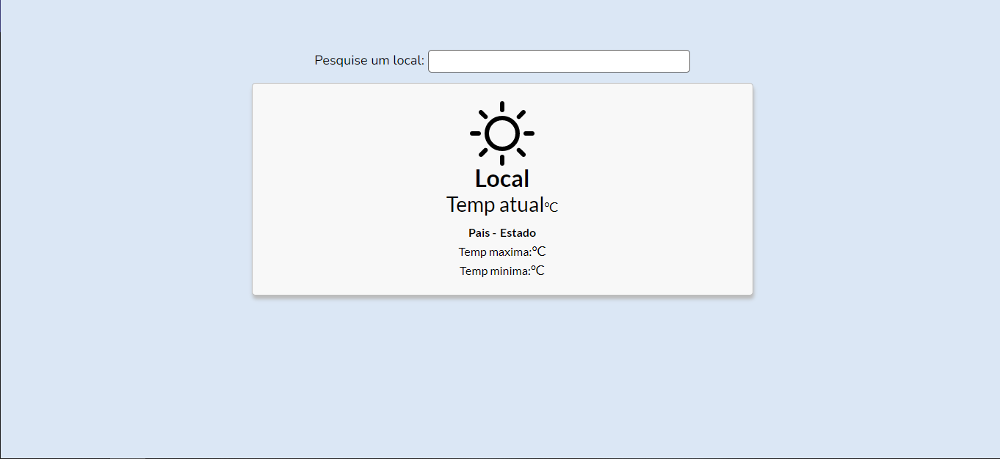

<h1 align="center">
   Clima
</h1>

  <a href="https://willianstephano.github.io/Clima/">
    <b>🚀Acesse o projeto 🚀</b>
  </a>
  
 <h5 align="center">
  Projeto em construção
</h5>

<h4 align="center">
  Projeto criado com o intuito de aprimorar meus conhecimentos nas tecnologias HTML, CSS, Js e consumo de API.
</h4>

<h6 align="center">
  O projeto consome a AccuWeather API  para consulta de dados de localidades de temperatura.
</h6>

## 📚 Seções
O projeto é composto por uma pagina que contem 2 seções principais:

- **Pesquisa de local:** Barra de pesquisa que busca uma localidade pelo nome;
- **Temperatura e dados:** Contem informações do nome do local pesquisado e tambem pais, estado, temperatura atual, temperatura maxima, temperatura minima e um icone representando a temperatura atual;

<h6 align="center">
 (Projeto temporariamente pausado devido a limitação de request diarias disponibilizado pela API que dificulta o desenvolvimento) :/
</h6>

---

## 💼 Tecnologias utilizadas
Para o desenvolvimento deste projeto utilizei as seguintes tecnologias:

- HTML;
- CSS;
- JavaScript;
- API utilizada: https://developer.accuweather.com/apis/;

---

#### Autor
Willian Stephano
